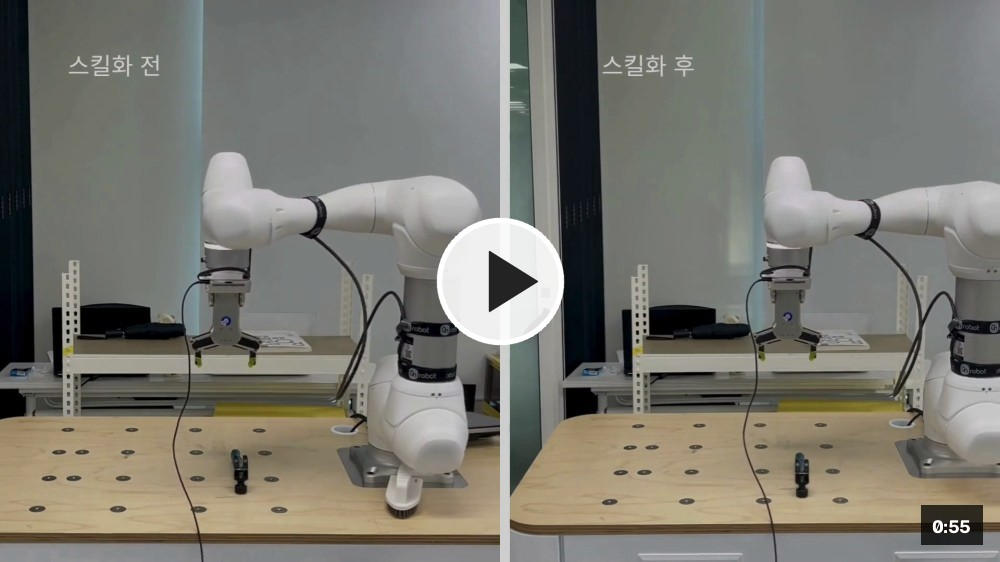

# Robot Skill System MVP

[](https://github.com/onlyho12-sketch/Dittobot/releases/download/demo/dittobot.mp4)

<sub>▶ 이미지를 클릭하면 시연 영상(55초)을 볼 수 있습니다.</sub>

## 실제 장치 실행: 터미널 2개

아래 명령은 이 워크스테이션의 Doosan M0609(`192.168.1.100`), ROS namespace `dsr01`,
로봇망 인터페이스 `enp3s0`, ROS domain `78` 기준입니다. 먼저 **터미널 1**에서 bringup을
실행하고 그대로 둡니다.

### 터미널 1 — Doosan bringup

```bash
source /opt/ros/humble/setup.bash
source /home/rokey/cobot_ws/install/setup.bash

export ROS_DOMAIN_ID=78
export ROS_LOCALHOST_ONLY=0
export RMW_IMPLEMENTATION=rmw_cyclonedds_cpp
export CYCLONEDDS_URI='<CycloneDDS xmlns="https://cdds.io/config"><Domain><General><Interfaces><NetworkInterface name="enp3s0"/></Interfaces></General></Domain></CycloneDDS>'

ros2 launch dsr_bringup2 dsr_bringup2_rviz.launch.py \
  name:=dsr01 mode:=real host:=192.168.1.100 port:=12345 model:=m0609
```

bringup이 완료되면 새 **터미널 2**에서 API/UI를 실행합니다. 아래 calibration gate는 실제
로봇 이동을 허용하므로 작업공간, Chessboard 고정, E-stop 및 21개 pose 계획을 확인한 경우에만
사용해야 합니다. `NPY TF 복사·검증`은 이동 명령을 보내지 않지만 같은 명시적 gate를 요구합니다.

### 터미널 2 — Dittobot API/UI (8001)

```bash
cd /home/rokey/Dittobot
source /opt/ros/humble/setup.bash
source /home/rokey/cobot_ws/install/setup.bash

export ROS_DOMAIN_ID=78
export ROS_LOCALHOST_ONLY=0
export RMW_IMPLEMENTATION=rmw_cyclonedds_cpp
export CYCLONEDDS_URI='<CycloneDDS xmlns="https://cdds.io/config"><Domain><General><Interfaces><NetworkInterface name="enp3s0"/></Interfaces></General></Domain></CycloneDDS>'
export PYTHONPATH="$PWD/src${PYTHONPATH:+:$PYTHONPATH}"

export ROBOT_EXECUTION_MODE=hardware
export ENABLE_HARDWARE_EXECUTION=true
export ROBOT_BACKEND=doosan
export ENABLE_REAL_ROBOT=true
export DRY_RUN=false
export ENABLE_HANDEYE_CALIBRATION=true
export CALIBRATION_POSE_PLAN_APPROVED=true
export CALIBRATION_CELL_SAFETY_VERIFIED=true
export DOOSAN_ROBOT_ID=dsr01
export DOOSAN_ROBOT_MODEL=m0609
export HANDEYE_LEGACY_NPY_PATH="$PWD/T_gripper2camera.npy"
export HANDEYE_LEGACY_EXPECTED_TCP=2FG_TCP

python3 -m uvicorn robot_skill_system.api.app:create_app \
  --factory --env-file .env --host 127.0.0.1 --port 8001
```

실행 후 UI는 `http://127.0.0.1:8001/ui/`, API 문서는
`http://127.0.0.1:8001/docs`에서 확인합니다. `.env`, 장치별 설정과 calibration artifact는
Git에 포함하지 않습니다.

작업자의 RGB-D 시연을 로컬 궤적 분석과 제한된 의미 분석으로 분해하고, 검증된
`SkillGraph`를 결정론적으로 컴파일하는 Python 3.10 프로젝트입니다. 현재 실행 가능한
End-to-End 경로는 완전한 오프라인 `MockRobotAdapter`이며 로봇·카메라·OpenAI API가 없어도
Teaching → Registry → Runtime → Update 흐름을 실행할 수 있습니다. `simulation` 모드는 아직
별도 물리 시뮬레이터가 아니라 같은 Mock adapter의 별칭입니다.

> RealSense D435i의 직접 `pyrealsense2` RGB-D preview/recording은 이 개발 장치에서 검증했지만,
> ROS 2 카메라 토픽과 Doosan M0609, OnRobot RG2, MoveIt 연동은 실제 장치에서 검증하지
> 않았습니다. Doosan/RG2 adapter는 인터페이스 자리만 제공하며 gate가 닫혀 있으면 authorization
> 오류, gate가 열려도 `NotConfiguredError`로 거부합니다. 환경 플래그만으로 실제 로봇을 움직일
> 수 없습니다.

## 설치

Ubuntu 22.04 / Python 3.10 기준입니다. 시스템 패키지를 자동 변경하지 않습니다.

```bash
cd <this-repository>
python3 -m venv .venv
source .venv/bin/activate
python -m pip install --upgrade pip
python -m pip install -e '.[dev,api]'
cp .env.example .env
```

RealSense UI를 사용할 환경에는 카메라 extra도 설치합니다.

```bash
python -m pip install -e '.[dev,api,realsense]'
```

Ubuntu 22.04에서 `ensurepip is not available` 또는 `python3.10-venv` 누락 오류가 나면 운영자가
시스템 정책을 확인한 뒤 다음을 직접 실행해야 합니다. 프로젝트와 설치 스크립트는 `sudo`를
자동 실행하지 않습니다.

```bash
sudo apt-get update
sudo apt-get install python3.10-venv
```

Mock 실행에는 API 키가 필요 없습니다. Live 의미 분석 또는 STT를 명시적으로 시험할 때만
`.env`의 `OPENAI_API_KEY`를 채우고 `OPENAI_MODE=live`로 바꿉니다. `.env`는 Git에서 제외됩니다.
이 프로젝트는 `.env`를 암묵적으로 읽지 않습니다. CLI live 명령에서는 필요한 값을 셸 환경에
직접 export하고, FastAPI에서는 아래 실행 예시처럼 Uvicorn의 `--env-file .env`를 사용합니다.

```bash
export OPENAI_MODE=live
export OPENAI_API_KEY='<your-key>'
```

현재 검증에서는 실제 API key를 사용한 OpenAI live 호출을 수행하지 않았습니다. `.env.example`의
모델 ID는 설정 예시이며 해당 계정에서 사용할 수 있는지는 live 실행 전에 별도로 확인해야 합니다.

## Mock 실행

저장소 루트에서:

```bash
source .venv/bin/activate
robot-skill inspect
robot-skill capture-scene --backend mock --mode mock
robot-skill demo-e2e
robot-skill execute --text "파란 걸레로 오른쪽 테이블을 숙련자 방식으로 닦아줘" --mode mock
```

음성 파일 STT도 기본 mock 모드에서 네트워크 없이 실행됩니다. Mock은 같은 경로의 `.txt`
sidecar가 있으면 그 내용을 사용합니다. Audio 경로 자체는 존재해야 하며, transcription 결과를
runtime 명령으로 자동 전달하지는 않습니다.

```bash
robot-skill transcribe /path/to/command.wav
```

모듈 방식도 동일합니다.

```bash
PYTHONPATH=src python3 -m robot_skill_system.cli demo-e2e
```

보조 명령 이름도 지원합니다. `execute-skill`은 의도적으로 `--dry-run`만 허용하며, 먼저
`demo-offline` 또는 `induce-skill`로 활성 스킬을 등록해야 합니다.

```bash
PYTHONPATH=src python3 -m robot_skill_system.cli demo-offline
PYTHONPATH=src python3 -m robot_skill_system.cli capture-scene --backend mock
PYTHONPATH=src python3 -m robot_skill_system.cli validate-skill --skill wipe_surface
PYTHONPATH=src python3 -m robot_skill_system.cli execute-skill --skill wipe_surface --dry-run
```

Teaching/Update 예제:

```bash
robot-skill induce-skill --demo tests/fixtures/demonstrations/novice_wipe.json
robot-skill update-skill --skill-id wipe_surface --demo tests/fixtures/demonstrations/expert_wipe.json
robot-skill list-skills
robot-skill rollback --skill-id wipe_surface --version 1.0.0
```

실행 가능한 예제 스크립트도 모두 Mock 전용입니다.

```bash
PYTHONPATH=src python3 examples/offline_teaching_demo.py
PYTHONPATH=src python3 examples/offline_runtime_demo.py
PYTHONPATH=src python3 examples/expert_update_demo.py
```

기본 SQLite 경로는 `data/robot_skills.db`, 기본 Artifact Store root는 `data/`입니다.
`DATABASE_URL`과 `ARTIFACT_ROOT`로 변경할 수 있습니다. 현재 애플리케이션이 실제로 쓰는 주요
경로는 다음과 같습니다.

- `data/demonstrations/<session_id>/`: teaching metadata, capture/final JSON
- `data/scenes/<scene_id>.json`: SceneSnapshot JSON
- `data/skills/<skill_id>/<version>/`: graph, compiled module, validation report, manifest
- SQLite `execution_runs`/`execution_events`: 실행 상태와 구조화 이벤트

현재 CLI/API teaching-session capture는 원본 RGB, depth, audio, point cloud를 자동 녹화하지
않습니다. 별도의 UI Camera API는 사용자가 명시적으로 시작한 동안 RGB JPEG와 color 좌표계에
정렬된 depth NPZ를 `data/demonstrations/rgbd_<id>/`에 기록하고 checksum manifest를 만듭니다.
SQLite에는 생성된 Python이나 bulk camera payload가 아니라 메타데이터와 URI/checksum이 저장됩니다.

## FastAPI

```bash
PYTHONPATH="$PWD/src${PYTHONPATH:+:$PYTHONPATH}" python3 -m uvicorn robot_skill_system.api.app:create_app \
  --factory --env-file .env --host 127.0.0.1 --port 8000
```

`/docs`에서 Teaching, Scene, Skills, Runtime API를 확인할 수 있습니다. Runtime 요청 기본 mode는
`dry_run`이지만 현재 구현에서는 이것도 MockRobot 명령을 실행·기록하는 오프라인 경로입니다.
Hardware 요청은 아래 다섯 환경 gate를 만족해도 구성된 Doosan adapter가 없어 거부됩니다.

운영 UI는 같은 서버의 `http://127.0.0.1:8000/ui`에서 열 수 있습니다. UI는 `/skills`를 통해
SQLite 레지스트리를 읽고, 스킬 전체 Mock 검증·활성화와 Scene 캡처 → binding → preflight →
Mock 실행/중단 API를 호출합니다. 일시정지·재개와 ROS 2/실기 실행은 아직 연결하지 않았으며 UI도
이를 활성 기능처럼 모사하지 않습니다. `file://`로 HTML을 직접 여는 대신 FastAPI가 제공하는
경로를 사용해야 동일 출처 API 연결이 보장됩니다.

모니터링 화면의 `RGB-D 켜기`를 누르면 RealSense RGB/Depth preview가 시작되고, `모션 녹화 시작`을
누른 동안만 로컬 RGB-D artifact를 기록합니다. preview/capture는 기본 30 FPS를 유지하고 저장은
기본 10 FPS로 샘플링하며 `REALSENSE_RECORDING_FRAMES_PER_SECOND`로 조정할 수 있습니다. 기본 최대 시간은 60초이며
`REALSENSE_MAXIMUM_RECORDING_DURATION_S`로 더 낮게 제한할 수 있습니다. API 서버는 인증이 없으므로
카메라 화면을 외부 네트워크에 노출하지 말고 `127.0.0.1`에 바인딩해야 합니다.

같은 모니터링 패널의 `Calibrate` 버튼은 손목/브라켓 장착 RealSense와 고정 10×7, 25mm
Chessboard를 위한 eye-in-hand 보정 세션을 시작합니다. 로봇은 먼저
J1/J2가 0°에 있어야 합니다. `Calibrate`를 누르면 측정된 J1/J2 값을 고정한 채 J3–J6를
`[90,0,90,0]`으로 먼저 이동합니다. 이후 21개 고정 pose는 J1/J2를 바꾸지 않고 J3–J6도
기준 대비 최대 ±5°, 인접 pose 사이 joint별 최대 5°만 움직입니다. 매 pose의 RGB,
joint, flange pose로 `T_flange_camera`를 계산하고 오차 기준을 통과한 결과만
`data/calibrations/handeye_<id>/`에 저장합니다. 이 버튼은 기본 비활성화되어 있으며, 모든 로봇
hardware gate와 별도의 pose-plan/cell-safety/calibration gate가 열린 경우에만 실제 이동을
요청합니다. 결과는 ROS TF로 자동 publish되지 않으며 runtime 실기 권한도 만들지 않습니다.

옆의 `NPY TF 복사·검증` 버튼은 `T_gripper2camera.npy` 원본을 덮어쓰지 않고 고유 artifact
폴더에 먼저 복사한 뒤, 현재 flange/TCP pose를 읽어 `T_flange_camera` 후보로 변환하고 기존
Chessboard 관측으로 교차 검증합니다. 이 동작은 로봇을 움직이지 않습니다. 검증 통과 후보만 이후
Candidate SkillGraph에 provenance로 연결되며, 실패 결과도 원인 확인용으로 보존되지만 좌표 근거로
사용되지 않습니다. NPY 검증 실패나 NPY 부재는 surface-relative Mock Candidate 등록을 차단하지
않지만, 실제 로봇 TF 권한이나 하드웨어 실행 근거로 승격되지도 않습니다.

UI의 `스킬 만들기` 화면은 서버 재시작 뒤에도 `rgbd_manifest.json`을 검색해 완료된 녹화를 다시
불러옵니다. RGB/Depth 프레임 슬라이더와 저장 FPS 기준 재생으로 내용을 확인한 뒤 스킬 ID, 작업
설명, 대표 프레임 수를 지정할 수 있습니다. 서버는 균등 간격의 RGB와 checksum 검증된 정렬 Depth
NPZ의 TURBO 컬러맵을 한 쌍으로 구성해 `OPENAI_MAX_KEYFRAMES` 한도 내에서 최대 300쌍까지 OpenAI
Responses API에 보냅니다. 각 쌍은 RGB 다음 Depth 순서이며, 현재 모델이 video input을 지원하지
않아 원본 영상 파일은 보내지 않습니다. 프롬프트는 두 개의 의도적으로 편 fingertip을 gripper jaw로
보고 모든 대표 프레임마다 jaw 끝점/중점의 정규화 이미지 좌표 또는 명시적인 미검출 이유를 반드시
반환하게 합니다. 사람 손 모양, 툴 모양, 작업대 평면 후보 ROI도 구조화해 반환하지만, 이 값들은
semantic 이미지 힌트일 뿐 camera/robot 좌표나 metric pose가 아닙니다.
직접 이미지 입력이 거부되면 선택된 RGB-D JPEG의 ZIP을 로컬 artifact로 보존하고, 비전 모델이
해석할 수 있는 PDF contact sheet를 `input_file`로 자동 재전송합니다. ZIP 자체는 비전 입력으로
보내지 않습니다. raw depth NPZ, 로컬 절대 경로 및 API key도 보내지 않습니다. 결과는 녹화 아래
`skill_drafts/<draft_id>.json`에 저장되는 실행 불가 semantic draft입니다. 실제 실행 가능한 스킬에는
별도의 robot/tool pose trajectory, TF와 로컬 안전 검증이 필요합니다.

스킬 관리 화면은 이 artifact를 SQLite SkillGraph와 섞지 않고 `분석 초안`으로 별도 표시합니다.
초안 상세의 승격 체크리스트는 RGB-D 증거, 두 손가락 TCP 프록시, 보정 TF, 신뢰 가능한 pose
trajectory, Mock 검증 상태를 보여 줍니다. `Depth 평면 자동 추출`은 GPT의 작업대 ROI를 힌트로만
사용하고 원본 aligned Depth와 저장된 카메라 intrinsics에 deterministic RANSAC/SVD를 적용해
`T_camera_surface`를 계산합니다. 3점 수동 보정도 그대로 사용할 수 있습니다. `GPT TCP 경로 적용`은
GPT의 정규화 fingertip 위치를 원본 Depth로 다시 deproject하며, 4개 이상 유효한 3D 샘플이 없으면
누락 원인과 함께 실패합니다. `경로 티칭 시작`의 수동 방식도 유지됩니다. 증거 검증 뒤에만
`Candidate로 등록`이 활성화되고 컴파일·Mock 검증이 실행됩니다. 이 Candidate는 비활성·실기
호환 불가 상태이며, 실제 로봇 재생에는 별도로 검증한 `robot_base → camera/surface` TF와 FK,
로봇 안전 검증이 필요합니다. Chessboard/관절각 hand-eye 보정 구성은
[Hardware setup](docs/HARDWARE_SETUP.md#tf-hierarchy-and-chessboard-calibration)을 참고하십시오.

## 검사

```bash
python3 -m compileall src tests
python3 -m pytest -q
python3 -m ruff check .
python3 -m mypy src
robot-skill demo-e2e
```

시스템 전역 pytest/plugin 버전이 충돌하는 환경에서는 프로젝트 가상환경 사용을 권장합니다.
격리 진단에는 `PYTEST_DISABLE_PLUGIN_AUTOLOAD=1 pytest -q`를 사용할 수 있습니다.

## RealSense 경계

Core/Mock 모드는 `pyrealsense2` 없이 import됩니다. UI Camera API만 lazy direct adapter를 열며,
RGB와 color 좌표계 정렬 depth를 MJPEG로 표시하고 원본 장치 timestamps/clock domains, intrinsics,
depth scale, 파일 checksum을 녹화 manifest에 보존합니다. 시작 직후 동기화되지 않은 프레임은
제한 횟수 안에서만 건너뛰고, 20ms 이내의 RGB/depth pair를 얻지 못하면 실패합니다.

이 개발 환경에서는 D435i, librealsense 2.58.3, firmware 5.17.0.10, 640×480@30fps로 단일 프레임과
1초 RGB-D 녹화를 검증했습니다. 장치 serial은 소스나 문서에 고정하지 않으며 배포 시
`REALSENSE_DEVICE_SERIAL`로 지정합니다. 녹화는 영상 기반 모션 원본일 뿐 손/도구 pose나
robot-base trajectory를 아직 생성하지 않습니다. CLI `capture-scene`은 계속 Mock 전용이고,
ROS의 `realsense2_camera` topic/rosbag adapter와 지속 Scene obstacle 갱신도 아직 구현되지 않았습니다.

ROS 2 순서:

```bash
source /opt/ros/humble/setup.bash
source <your-ros-workspace>/install/setup.bash
```

상세 항목은 [Hardware setup](docs/HARDWARE_SETUP.md)을 참고하십시오.

## Doosan/RG2 Hardware Mode

초기 저장소와 실행 환경에는 `DSR_ROBOT2`, 검증된 Doosan ROS 2 서비스/Action, RG2 드라이버가
발견되지 않았습니다. 실제 패키지 버전, import, namespace, 함수 시그니처, TCP/load/force 단위를
셀에서 확인하고 adapter와 hardware validator를 구현한 뒤에만 다음 다섯 gate를 모두 엽니다.

```bash
export ROBOT_EXECUTION_MODE=hardware
export ENABLE_HARDWARE_EXECUTION=true
export ROBOT_BACKEND=doosan
export ENABLE_REAL_ROBOT=true
export DRY_RUN=false
```

`ENABLE_HARDWARE_EXECUTION`은 legacy enable gate이며 생략할 수 없습니다. 다섯 gate 뒤에도 연결,
E-stop, 최신 Scene, 검증된 Graph/Tool, 실제 IK·관절·자체/환경 충돌·특이점 검사, hardware-verified
workspace/scene monitor와 force supervisor가 모두 필요합니다. 현재 validator는 Mock 표시가 붙은
TCP/명시 경로 geometry만 제공하므로 hardware 승인을 만들 수 없습니다.

현재 adapter protocol의 motion/force vendor 호출은 blocking입니다. 장애물 hook과 힘 측정은 호출
전후에만 실행되며 호출 중 연속 polling이나 즉시 중단을 보장하지 않습니다. 별도의 safety-rated
monitor 또는 interruptible/streaming vendor API를 연결하기 전에는 실제 로봇에 사용하면 안 됩니다.
테스트는 실제 vendor driver나 로봇 하드웨어에 명령을 보내지 않았습니다.

## OpenAI 구현 범위

Live 경로 코드는 공식 Python SDK의 Responses structured output
(`responses.parse` + Pydantic), Audio Transcriptions, Embeddings API를 사용합니다. 모든 실제 좌표,
profile 수치, graph 검증, compilation과 실행 권한은 로컬 코드에 남습니다. Strict function-tool
descriptor와 6개 read-only 로컬 dispatcher, bounded Responses tool-call loop도 구현되어 있습니다.
Application의 live `/runtime/resolve`는 현재 registry와 Scene의 검증된 read-only snapshot을
dispatcher로 주입합니다. Demonstration analyzer와 graph composer는 strict structured output만
사용합니다. 자세한 내용은
[OpenAI integration](docs/OPENAI_INTEGRATION.md)을 참고하십시오.

## 설계 문서

- [Implementation plan](docs/IMPLEMENTATION_PLAN.md)
- [Architecture](docs/ARCHITECTURE.md)
- [OpenAI integration](docs/OPENAI_INTEGRATION.md)
- [Scene/Skill schema](docs/SKILL_SCHEMA.md)
- [Data schema and version rules](docs/DATA_SCHEMA.md)
- [Safety](docs/SAFETY.md)
- [Hardware setup](docs/HARDWARE_SETUP.md)
